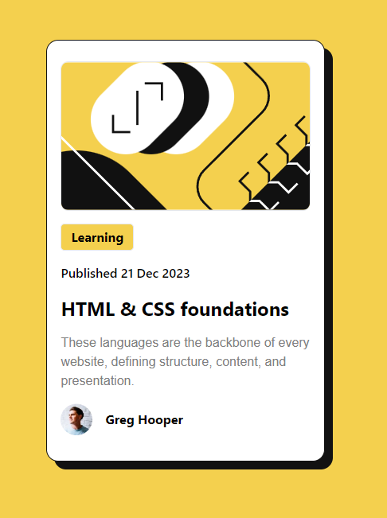

# Frontend Mentor - Blog preview card solution

This is a solution to the [Blog preview card challenge on Frontend Mentor](https://www.frontendmentor.io/challenges/blog-preview-card-ckPaj01IcS). Frontend Mentor challenges help you improve your coding skills by building realistic projects.

## Table of contents

- [Overview](#overview)
  - [The challenge](#the-challenge)
  - [Screenshot](#screenshot)
  - [Links](#links)
- [My process](#my-process)
  - [Built with](#built-with)
  - [What I learned](#what-i-learned)
- [Author](#author)

## Overview

### The challenge

Users should be able to:

- See hover and focus states for all interactive elements on the page

### Screenshot



### Links

- Solution URL: [Add solution URL here](https://github.com/alexmina12/FrontEnd-Mentor-Blog.git)
- Live Site URL: [Add live site URL here](https://your-live-site-url.com)

## My process

### Built with

- Semantic HTML5 markup
- CSS custom properties
- Flexbox
- Mobile-first workflow
- Tailwind CSS
- Custom Tailwind CSS variables
- Vite + Reactjs

### What I learned

```html
colors: { primary: "hsl(var(--color-primary) /
<alpha-value
  >)", neutralGrey: "hsl(var(--neutral-gray) / <alpha-value)", }, fontFamily: {
  Figtree: ["Figtree", "sans-serif"], },</alpha-value
>
```

## Author

- Website - [Add your name here](https://www.your-site.com)
- Frontend Mentor - [@alexmina12](https://www.frontendmentor.io/profile/yourusername)
- Instagram - [@minaiosif](https://www.instagram.com/minaiosif/)
